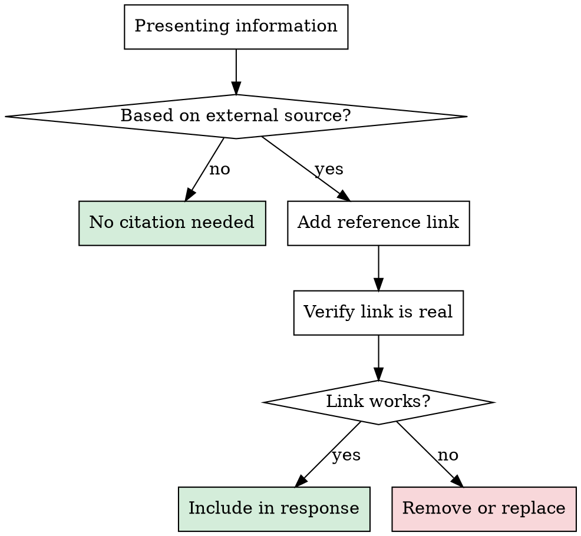

# Cite Sources With Verification

## Overview

Every research or search result must include reference links. Every link must be verified as real.

**Core principle:** No link without verification. No research without links.

**Violating the letter of this rule is violating the spirit of this rule.**

## The Iron Law

```
NO REFERENCE LINKS WITHOUT VERIFICATION
NO RESEARCH RESULTS WITHOUT REFERENCE LINKS
```

## When This Applies

**Triggers — ANY of these activate this skill:**
- Answering questions about libraries, frameworks, APIs
- Recommending tools, packages, or approaches
- Explaining how something works based on external knowledge
- Researching best practices or patterns
- Comparing technologies or solutions
- Citing documentation, blog posts, or official guides
- Code review findings that reference external standards

**Does NOT apply to:**
- Purely local codebase analysis (grep, LSP, AST — the code IS the source)
- Opinions or reasoning from first principles
- General programming knowledge (e.g. "a for loop iterates")

## The Gate



## Verification Methods

**For every link, use ONE of these to confirm it's real:**

| Method | When to Use | How |
|--------|-------------|-----|
| **Fetch the URL** | Web pages, docs, blog posts | Fetch the URL directly and check the content |
| **Web search** | Find the real URL if unsure | Use a web search tool to locate the page |
| **GitHub search** | Repos, issues, code examples | Search GitHub for the repository or code |
| **Documentation lookup** | Library documentation | Query official docs via documentation tools |

### Verification Steps

1. **Construct the URL** from memory or search
2. **Fetch or search** to confirm it resolves to real content
3. **Check the content** matches what you're claiming
4. **If broken** — search for the correct URL or remove the claim

```
# Example: verify a documentation link
Fetch the URL and confirm the page exists and content matches your claim

# Example: find the real URL when unsure
Search the web for "FastAPI official documentation on dependency injection"
→ Get verified URL from search results
```

## Output Format

When presenting research results, include a **References** section:

```markdown
## References
- [FastAPI Dependency Injection](https://fastapi.tiangolo.com/tutorial/dependencies/) — official docs ✅
- [Pydantic V2 Migration Guide](https://docs.pydantic.dev/latest/migration/) — verified ✅
```

For inline citations, link naturally:

```markdown
According to the [official Redis documentation](https://redis.io/docs/latest/commands/keys/),
the KEYS command is O(N) and should not be used in production. ✅
```

**The ✅ marker indicates you verified the link.** Only add it AFTER verification.

## Red Flags - STOP

- About to paste a URL you haven't fetched or searched for
- Writing "see https://..." from memory without verification
- Constructing a URL that "looks right" (e.g. guessing path structure)
- Providing a docs link for a specific version without confirming the path
- Referencing a blog post or article without confirming it exists
- Thinking "this URL is definitely correct, no need to check"

## Rationalization Prevention

| Excuse | Reality |
|--------|---------|
| "I'm sure this URL is correct" | Memory fabricates URLs. Verify. |
| "It's a well-known site" | Well-known sites restructure paths. Verify. |
| "The domain is right, path probably works" | Probably ≠ verified. Fetch it. |
| "I just saw this link in search results" | Search results can be stale. Click through. |
| "Verification slows me down" | A hallucinated link destroys trust instantly. |
| "It's just a reference, not critical" | Every link reflects your credibility. Verify. |

## Handling Verification Failures

**Link is broken (404, timeout):**
- Search for the correct URL
- If found → use the correct URL with verification
- If not found → remove the link, state the information without citation, and note: "⚠️ Unable to find a verified source for this claim"

**Content doesn't match claim:**
- Correct your claim to match the actual content
- Or find a different source that supports the claim

**No source exists:**
- Be honest: "This is based on my general knowledge, not a specific source"
- Do NOT fabricate a link

## Common Mistakes

**Guessing documentation paths**
- ❌ `https://docs.python.org/3/library/asyncio-task.html`
- ✅ Fetch first, discover the actual path

**Mixing up version-specific URLs**
- ❌ Linking to v2 docs when discussing v3 behavior
- ✅ Verify the URL content matches the version being discussed

**Forgetting to cite at all**
- ❌ "Redis KEYS is O(N) and blocks the server"
- ✅ "Redis KEYS is O(N) and blocks the server ([source](https://redis.io/docs/latest/commands/keys/)) ✅"

## The Bottom Line

**A hallucinated link is worse than no link.**

Research without sources is opinion. Sources without verification are hallucination.
Verify first, cite second, present third.
