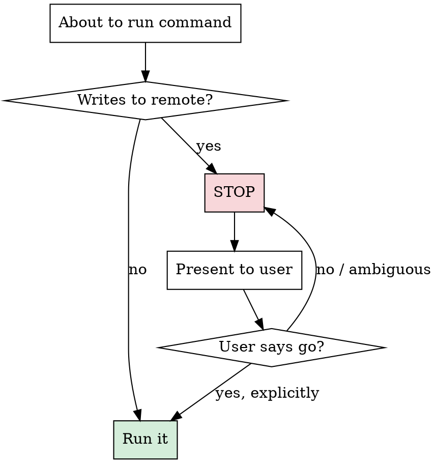

# No Remote Without Approval

## Overview

All remote-mutating operations require explicit user approval. No exceptions.

**Core principle:** Work locally, present results, push only when the user says "go."

**Violating the letter of this rule is violating the spirit of this rule.**

## The Iron Law

```
NO REMOTE WRITES WITHOUT EXPLICIT USER APPROVAL IN THIS CONVERSATION
```

## Blocked Operations

Any command that **writes to a git remote or GitHub** is blocked until approved:

| Category | Blocked Commands |
|----------|-----------------|
| **Push** | `git push`, `git push --force`, `git push -u`, `git push origin ...` |
| **Pull Requests** | `gh pr create`, `gh pr merge`, `gh pr close`, `gh pr reopen` |
| **PR Metadata** | `gh pr edit`, updating PR title/body/labels/reviewers |
| **PR Reviews** | `gh pr review`, posting review comments via `gh api` |
| **PR Comments** | `gh pr comment`, `gh api repos/.../issues/.../comments` (POST/PATCH) |
| **Releases** | `gh release create`, `gh release edit`, `gh release delete` |
| **Remote Refs** | `git tag` + `git push --tags`, `git branch -d` on remote |
| **Any gh API write** | Any `gh api` call using POST, PUT, PATCH, DELETE on remote resources |

## Allowed Without Approval

| Category | Allowed Commands |
|----------|-----------------|
| **Local git** | `git add`, `git commit`, `git branch`, `git checkout`, `git merge`, `git rebase`, `git stash`, `git diff`, `git log` |
| **Read-only remote** | `git fetch`, `git pull`, `gh pr view`, `gh pr list`, `gh pr diff`, `gh api` (GET only), `gh repo view` |
| **Local build/test** | Any build, lint, test command |

## The Gate



**Before ANY blocked operation:**

1. **STOP** - Do not execute the command
2. **PRESENT** - Show the user exactly what you want to run and why
3. **WAIT** - Ask for explicit approval
4. **ONLY THEN** - Execute if user explicitly approves

### Presentation Format

```
I'd like to push/create PR/update remote. Here's what I'll do:

  <exact command(s) to run>

Reason: <why this is needed>

OK to proceed?
```

## What Counts as Approval

**Explicit approval (proceed):**
- "Yes", "Go ahead", "Do it", "Push it", "OK", "Approved"
- "Go", "Ship it", "LGTM", "Proceed"
- Any clear affirmative in context

**NOT approval (do NOT proceed):**
- Silence (no response yet)
- "Maybe", "I'll think about it", "Let me check"
- User discussing something else
- Approval from a previous conversation
- Blanket future approval ("just push whenever")

**Approval is per-operation, per-conversation.** "Push to feature-branch" does not approve "gh pr create."

## Red Flags - STOP

- About to run `git push` after finishing work
- About to run `gh pr create` after completing implementation
- Typing a `gh api` command with POST/PATCH/DELETE
- Subagent about to push (delegate the rule to subagents too)
- Thinking "user obviously wants this pushed"
- Thinking "this is a trivial update, no need to ask"

## Rationalization Prevention

| Excuse | Reality |
|--------|---------|
| "User asked me to create a PR" | Creating PR = remote write. Present the command, get approval. |
| "User said 'finish the task'" | Finishing != pushing. Present what you want to push. |
| "It's just a small fix" | Size doesn't matter. All remote writes need approval. |
| "User already approved the plan" | Plan approval != push approval. Ask again. |
| "The PR is already created, just updating" | Updates are remote writes. Ask. |
| "Subagent will handle it" | Subagents follow the same rule. Instruct them. |
| "User said 'ship it' last time" | Approval is per-operation, per-conversation. |

## Subagent Delegation

When delegating to subagents, **explicitly include this constraint**:

```
MUST NOT DO:
- Do NOT run git push, gh pr create, gh pr merge, or any command that writes to a remote repository
- All remote operations require explicit user approval — present what you want to do and wait
```

## Common Mistakes

**Assuming intent = approval**
- User says "create a PR for this" → Still present the command and ask
- User says "push when ready" → Still present what you'll push and confirm

**Forgetting PR metadata updates**
- Editing PR description, adding labels, requesting reviewers — all remote writes

**gh api blind spots**
- `gh api repos/.../pulls -f ...` is a POST → blocked
- `gh api repos/.../pulls/123/comments` → blocked

## The Bottom Line

**Local work is free. Remote writes cost trust.**

Do the work. Show the results. Push only when told.
