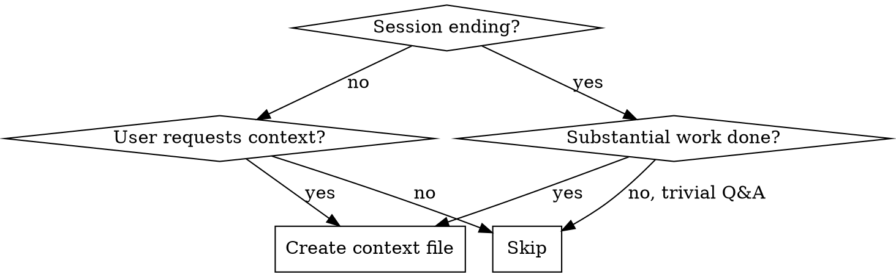
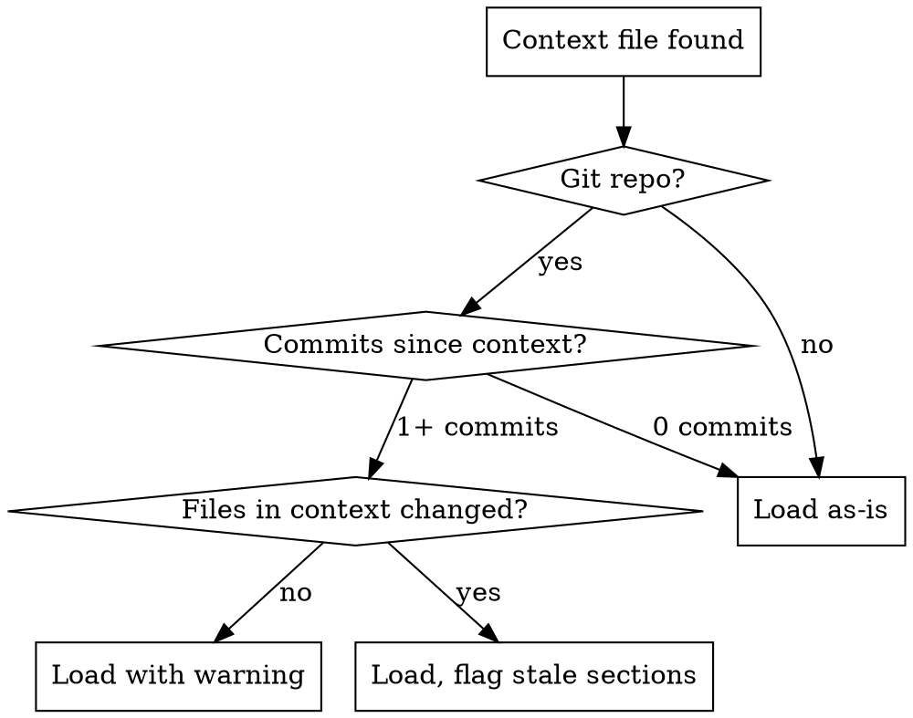

# Session Context

## Overview

Create structured context documents that let the next session pick up exactly where this one left off.

**Core principle:** Context files capture *state and decisions*, not history. History lives in `.history/` logs. Context is an actionable snapshot for resumption.

## When This Applies



**Triggers:**
- Session ending after meaningful work (2+ file edits, or architecture decisions made)
- User says: "寫交接", "save context", "write context", "我要離開了", or similar
- Switching to a different task mid-session

**Do NOT create context for:**
- Pure Q&A sessions with no state changes
- Sessions that only read/explored code without decisions

## File Structure

```
{workdir}/
  .history/
    context/
      {timestamp}_{topic}-context.md
```

**Naming:** Same convention as session-history-logging.
- `{timestamp}`: `YYYY-MM-DD_HH-MM` (24h, local time)
- `{topic}`: 2-4 word kebab-case slug from session's primary task
- Suffix: `-context.md`

Examples:
- `2026-03-24_14-30_auth-refactor-context.md`
- `2026-03-24_16-00_fix-webhook-bug-context.md`

## Context Document Template

```markdown
# Context: {topic}

**Created**: {YYYY-MM-DD HH:MM}
**Branch**: {current git branch, or "no repo"}
**Status**: {In Progress | Complete | Blocked}

## Goal

{One sentence: What are we trying to accomplish?}

## Current State

{What's working, what's broken, what's partially done. Be specific — file paths, line numbers, error messages.}

## Key Decisions

| Decision | Rationale |
|----------|-----------|
| {what was decided} | {why — the alternative considered and why rejected} |

## Completed Work

- [x] {what was done}
- [x] {what was done}

## Not Yet Done

- [ ] {next step — specific, actionable}
- [ ] {next step}

## Failed Approaches

{What was tried and didn't work. Include WHY it failed. This prevents the next session from retrying dead ends.}

> ⚠️ Do not retry: {specific approach} — failed because {reason}

## Code Context

{Key file paths, function signatures, API shapes that the next session needs. Only include what's NOT obvious from reading the code.}

## Resume Instructions

{Exact steps to pick up where we left off. Be specific enough that a fresh agent can act immediately.}

1. {first thing to do}
2. {second thing to do}
```

### Section Rules

**Mandatory (always include):**
- Goal
- Current State
- Key Decisions

**Optional (include when relevant):**
- Completed Work — when there's a checklist to track
- Not Yet Done — when there are clear next steps
- Failed Approaches — when dead ends were discovered (**strongly recommended**)
- Code Context — when non-obvious technical details matter
- Resume Instructions — when the next session needs specific startup steps

## New Session: Auto-Detection

**On starting a new session, BEFORE any work:**

1. Check if `{workdir}/.history/context/` exists
2. If it has context files, list them sorted by timestamp (newest first)
3. Apply staleness detection (see below)
4. Present findings to user

### Staleness Detection (Git-Aware)



**How to check:**
```bash
# Get context file's timestamp
CONTEXT_DATE=$(stat -f %Sm -t %Y-%m-%dT%H:%M "%s" "$CONTEXT_FILE")

# Count commits since context was written
git log --oneline --since="$CONTEXT_DATE" | wc -l

# Check if files mentioned in context were modified
git diff --name-only "$CONTEXT_DATE"..HEAD
```

**Presentation to user:**

```markdown
📋 Found context file: `2026-03-24_14-30_auth-refactor-context.md`
- Status: In Progress
- Goal: Implement OAuth2 authentication
- ⚠️ 3 commits since this context was written
- ⚠️ `src/auth/oauth.ts` was modified (mentioned in context)

Load this context? [Y/n]
```

## Parallel Session Conflicts

When multiple context files exist for overlapping work:

**Detection:** Two or more context files where:
- Created within 24h of each other, AND
- Topic slugs share 2+ words, OR
- `Goal` sections reference the same files/modules

**Resolution: Show both, let user choose.**

```markdown
📋 Found 2 potentially related context files:

**[A]** `2026-03-24_14-30_auth-refactor-context.md`
- Status: In Progress
- Goal: Refactor OAuth2 to use httpOnly cookies
- Branch: feature/auth-cookies

**[B]** `2026-03-24_16-00_auth-token-fix-context.md`
- Status: Complete
- Goal: Fix token refresh 500 error
- Branch: fix/token-refresh

Options:
1. Load [A] only
2. Load [B] only
3. Load both (I'll reconcile)
4. Ignore both, start fresh
```

## Writing Guidelines

**Good context files:**
- Specific: file paths, line numbers, error messages verbatim
- Actionable: next steps a fresh agent can execute immediately
- Honest: clearly state what's broken or uncertain
- Concise: under 200 lines. Point to `.history/` logs for full details.

**Bad context files:**
- ❌ Restating the entire conversation (that's what `.history/` is for)
- ❌ Vague status: "mostly done" (which parts? what's left?)
- ❌ Missing rationale in Key Decisions (decisions without "why" are useless)
- ❌ Including secrets, tokens, or credentials

## Relationship to session-history-logging

| | session-history-logging | session-context |
|---|---|---|
| **Purpose** | Chronological record | Actionable state snapshot |
| **When written** | Every exchange | Session end or on-demand |
| **Format** | Append-only log | Structured template |
| **Location** | `.history/{ts}_{topic}-prompt.md` | `.history/context/{ts}_{topic}-context.md` |
| **Next session** | Reference for details | Starting point for work |

**Context files may reference history files:** "See `.history/2026-03-24_14-30_auth-refactor-summary.md` entries [3]-[7] for full discussion."

## Red Flags - STOP

- Ending a session with substantial work and no context file
- Writing a context file with no "Key Decisions" section
- Context file over 300 lines (you're writing a transcript, not a snapshot)
- Including secrets or credentials in context files
- Copying entire code blocks instead of referencing file paths

## Rationalization Prevention

| Excuse | Reality |
|--------|---------|
| "The history files are enough" | History is a log. Context is actionable state. Different purposes. |
| "I'll remember next session" | You won't. You're a new agent instance. Write it down. |
| "Not enough was done to warrant context" | If decisions were made, they need recording. |
| "It's obvious from the code" | Code shows WHAT, not WHY or WHAT'S NEXT. |
| "I'll write it next session from memory" | Session memory doesn't transfer. That's the whole point. |

## The Bottom Line

**History records what happened. Context transfers what matters.**

Write context at session end. Load context at session start. Never lose state between sessions.
